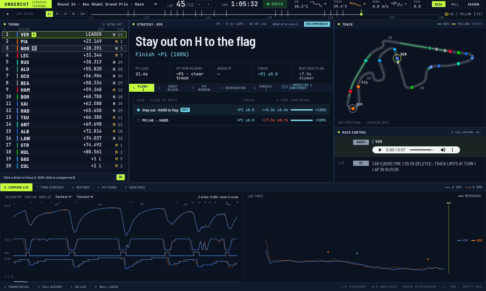

# F1 Data Package

TypeScript package for accessing F1 race data from OpenF1 API.

## Demo: Undercut strategy terminal

`packages/demo` is a race-strategy console built on the package. It replays any session lap by lap from real OpenF1 data, recommends a pit call, and ties every chart to one replay cursor. Run it with `pnpm demo`.


*Desk view, Abu Dhabi 2025, lap 45. Timing tower, pit-call recommendation, live car map and race control across the top. Below, VER's and NOR's fastest laps overlaid on a metre axis with corner numbers: speed, throttle, brake and gear.*

| | |
|---|---|
|  |  |
| **Race pace.** Clean-lap pace ranking with consistency and laps in traffic, plus the gap to the leader. Click the chart to jump the replay to that lap. | **Tyres.** Stints per driver (used sets marked, e.g. `M (3)`) and fuel-corrected wear rate by compound and team. |
|  |  |
| **Safety car.** Australia 2025, lap 35: the call flips to "Pit next lap", neutralised laps are shaded and retirements drop out. | **Monza.** A pit-next-lap call for LEC with its rejoin risk, and pit-stop times ranked. |


*Wall mode (`M`): large type for a second screen or the pit wall.*

## Install

```bash
pnpm install
pnpm build
```

## Quick Start (Friendly API)

Use year + race name + driver code - no session keys needed:

```typescript
import { 
  getRace,
  getSession,
  getLaps,
  getRaceStints,
  getRacePitStops,
  getRaceWeather,
  getRaceTelemetry,
} from "@f1/core";

// Get race by name
const race = await getRace({ year: 2026, name: "Miami" });

// Get session (defaults to first session)
const session = await getSession({ year: 2026, raceName: "Miami" });

// Get laps for a driver
const laps = await getLaps({ year: 2026, raceName: "Miami", driver: "VER" });

// Get stints, pit stops, weather, telemetry
const stints = await getRaceStints({ year: 2026, raceName: "Miami", driver: "VER" });
const pits = await getRacePitStops({ year: 2026, raceName: "Miami", driver: "VER" });
const weather = await getRaceWeather({ year: 2026, raceName: "Miami" });
const telemetry = await getRaceTelemetry({ year: 2026, raceName: "Miami", driver: "VER" });
```

## Available APIs

### Friendly API (Recommended)

Pass year + one of (raceName OR round) OR sessionKey:

- `getRace({ year, name?, round? })` - Find race by year + name or round
- `getSession({ year, raceName?, round?, session? })` - Find session (pass sessionKey to skip lookup)
- `getLaps({ year, raceName?, sessionKey?, driver?, lap? })` - Lap times
- `getRaceStints({ year, raceName?, sessionKey?, driver? })` - Tyre stint data
- `getRacePitStops({ year, raceName?, sessionKey?, driver? })` - Pit stop data
- `getRaceWeather({ year, raceName?, sessionKey? })` - Weather conditions
- `getRaceTelemetry({ year, raceName?, sessionKey?, driver? })` - Speed, throttle, brake, RPM, gear

### Low-level API (requires session key)
- `getMeetings(year)` - List all meetings for a year
- `getSessions(meetingKey)` - Sessions in a meeting
- `getDrivers(sessionKey)` - Drivers in a session
- `getOpenF1Laps(sessionKey, driverNumber)` - Lap times
- `getStints(sessionKey, driverNumber)` - Stint data
- `getPitStops(sessionKey, driverNumber)` - Pit stop data
- `getCarData(sessionKey, driverNumber)` - Speed, throttle, brake, RPM, gear
- `getPosition(sessionKey, driverNumber)` - Position data
- `getLocation(sessionKey, driverNumber)` - X, Y, Z coordinates
- `getWeather(sessionKey)` - Weather conditions
- `getRaceControl(sessionKey)` - Race control messages
- `getTeamRadio(sessionKey)` - Team radio messages
- `getOvertakes(sessionKey)` - Overtake data
- `getSessionResult(sessionKey)` - Session results
- `getStartingGrid(sessionKey)` - Starting grid
- `getIntervals(sessionKey)` - Interval data

## React Hooks

```typescript
import { 
  useRaceStints,
  useRacePitStops,
  useRaceWeather,
  useRaceTelemetry,
} from "@f1/react";

// Friendly hooks - no session keys needed
const { data: stints, isLoading } = useRaceStints(2026, "Miami", "VER");
const { data: pits } = useRacePitStops(2026, "Miami", "VER");
const { data: weather } = useRaceWeather(2026, "Miami");
const { data: telemetry } = useRaceTelemetry(2026, "Miami", "VER");
```

## Examples

```bash
# Race pace analysis
pnpm demo
```

## Architecture

```
packages/
├── core/           # Main API package
│   ├── src/api/    # OpenF1 API functions
│   └── src/schemas/ # Zod schemas
└── react/          # React bindings
```